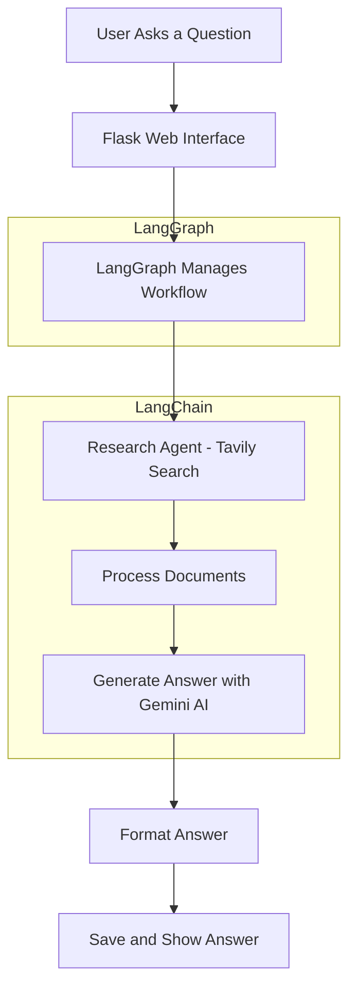

# Deep Research AI

**Deep Research AI** is a powerful research assistant that helps you gather information, process it, and generate detailed answers to your research queries using AI.

## 🚀 Features

- 🔍 **Advanced Research**: Uses **Tavily** to search the web for relevant documents.
- 🤖 **AI-Powered Answers**: Uses **Gemini AI** to generate insightful answers.
- 📝 **Formatted Output**: Answers are displayed with bullet points and emojis for easy reading.
- 💾 **Automatic Answer Saving**: Automatically saves research results for future reference.
- 🌐 **Web Interface**: Access the assistant via a simple web interface.

## 🏗️ Architecture

The Deep Research AI system works by following a workflow where a user submits a query, and the system performs the research and generates answers. Here’s a simple flow of how it works:

1. **User asks a question**: You input a research query.
2. **Flask Web Interface**: The query is handled by the web interface.
3. **LangGraph Workflow**: Manages the research process and state.
4. **Research Agent**: The system searches the web for relevant documents using Tavily.
5. **Document Processing**: Processes documents to extract key information.
6. **Answer Generation**: Uses Gemini AI to create detailed answers.
7. **Answer Formatting**: The answer is formatted and displayed in an easy-to-read format.
8. **Save and Display**: The answer is saved and shown to the user.

### Simple Flow Diagram


## 🛠️ Tech Stack

- **LangGraph**: Workflow orchestration and state management.
- **LangChain**: Document processing and AI integration.
- **Flask**: Web interface for user interaction.
- **Gemini AI**: Powers the AI-based answer generation.
- **Tavily**: Web crawling and research capabilities.

## 📦 Installation

1. Clone the repository:
   ```bash
   git clone https://github.com/yourusername/deep-research-ai.git
   ```

2. Install the required dependencies:
   ```bash
   pip install -r requirements.txt
   ```

## 🚀 Usage

1. Start the Flask server:
   ```bash
   python app.py
   ```

2. Open your browser and navigate to:
   ```
   http://localhost:5000
   ```

3. Enter your research query, and the system will generate and display the answer!

## 📝 Example Output

Here’s an example of how the research results will look:

```
🔍 Research Results

📌 Key Findings:
• First important point
• Second important point
• Third important point

💡 Insights:
• Insight 1
• Insight 2

📚 Sources:
• Source 1
• Source 2
```

---

## 📢 Contributing

We welcome contributions! If you have any suggestions or improvements, feel free to fork the repository, make changes, and submit a pull request.

---
