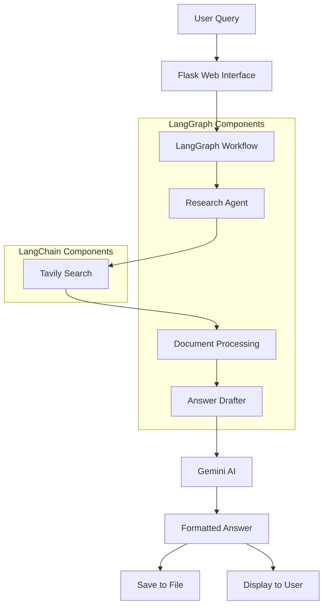

# Deep Research AI Architecture

## System Overview



## Component Details

### LangGraph Implementation
```python
# State Definition
class State(TypedDict):
    query: str
    docs: List[str]
    final_answer: str

# Graph Construction
graph = StateGraph(State)
graph.add_node("research", research_node)
graph.add_node("draft", answer_draft_node)
```

### LangChain Integration
- Document Processing
- Research Agent
- Answer Generation
- State Management

## Flow Description

1. **User Input**
   - Query entered through web interface
   - Sent to LangGraph workflow

2. **Research Phase**
   - LangGraph triggers research agent
   - Tavily search performed
   - Documents processed using LangChain

3. **Answer Generation**
   - Documents passed to answer drafter
   - Gemini AI generates formatted response
   - Answer saved and displayed

4. **Output**
   - Formatted answer with bullet points and emojis
   - Saved to file
   - Displayed to user 